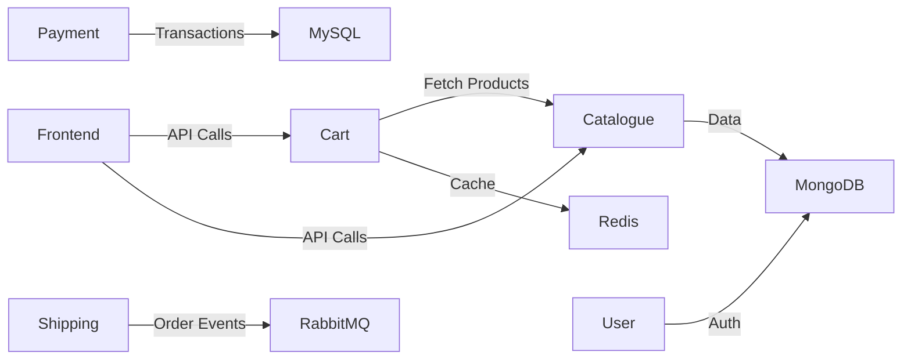

# 🛒 Roboshop Shell Automation

[](https://github.com/GorleJansi/shell-roboshop)  
[](LICENSE)

**Deploy Roboshop e-commerce microservices in ONE go! 🚀**

---

## 💡 What is Roboshop Shell?

Roboshop Shell is a collection of **Bash scripts** that automates the deployment of Roboshop microservices:

- **Frontend** – Web UI served via Nginx 🌐  
- **Catalogue** – NodeJS service serving products 📦 (MongoDB)  
- **Cart** – NodeJS service managing shopping carts 🛒 (Redis & Catalogue)  
- **User** – NodeJS service for registration & login 👤 (MongoDB & Redis)  
- **Payment** – Python service handling transactions 💳 (MySQL & RabbitMQ)  
- **Shipping** – Java service for deliveries 🚚 (MySQL & RabbitMQ)  

All scripts handle **installation, configuration, service setup, and database initialization** automatically.

---

## 📸 Architecture Overview


---

## ⚡ Key Features

- ✅ One-command deployment for any microservice  
- ✅ Installs & configures all dependencies: NodeJS, Python, MongoDB, MySQL, Redis, RabbitMQ, Nginx, Java  
- ✅ Sets up **system users & directories**  
- ✅ Configures **systemd services** for auto-start  
- ✅ Loads **initial database schema & master data**  
- ✅ Logs all actions in `/var/log/shell-roboshop`  
- ✅ Fail-safe execution with `set -euo pipefail` & error trapping  

---

## 🌐 How it Works



## 🚀 Quick Start

1. Clone the repo:
    ```bash
    git clone https://github.com/GorleJansi/shell-roboshop.git
    cd shell-roboshop


2. Make scripts executable:
    ```bash
    chmod +x *.sh


3.Run the orchestrator script for a service:
    ```bash
    sudo ./roboshop.sh <service-name>


4.Check logs:
    ```bash
    tail -f /var/log/shell-roboshop/<script_name>.log